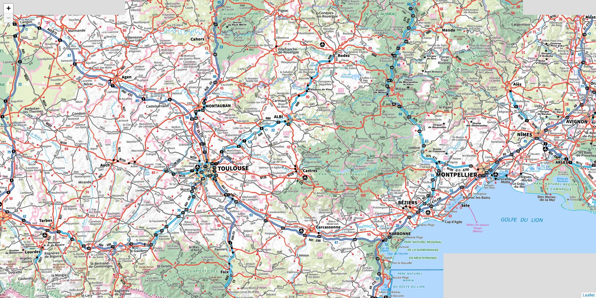

# mbviewer-php
Quick way to view a MBTiles map in your browser, nothing to install!

## Usage

```
php mbviewer.php localhost:8080 map.mbtiles
```

This will start a web server on localhost:8080, where you can see the MBTiles map directly.

